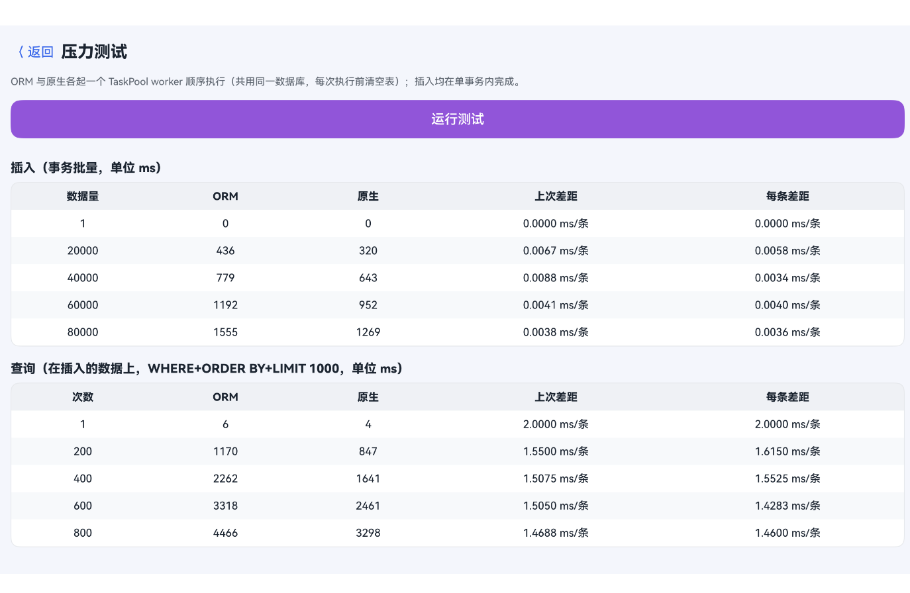

# RdbOrm

轻量级 RDB ORM，使用装饰器完成实体映射，链式构造查询条件，零 SQL 即可完成增删改查  
特点：根据装饰器自动建表，一键增删改查，TS-SQL自动映射

联系邮箱 121887765@qq.com  
当前引入APP：`一汽奥迪`、`哈啰出行`、`好未来学习机`、`大谷云` ...

## 安装

```bash
ohpm i @dims/rdborm
```

## 快速开始

### 1. 定义实体

`@Table` 声明表名，`@Field` 声明列，`@Id` 标主键，二者叠加使用。

```ts
import { Field, Id, Table } from '@dims/rdborm'

@Table('t_user')
class User {
  @Field({ type: 'INTEGER' })
  @Id({ autoIncrement: true })
  id?: number

  @Field({ type: 'TEXT' })
  name?: string

  @Field({ type: 'INTEGER' })
  age?: number
}
```

**装饰器说明**：

| 装饰器 | 作用 |
|---|---|
| `@Table('name')` | 绑定数据库表名 |
| `@Field({ ... })` | 声明列，参数必传。`type` **必填**，决定 SQL 类型（`INTEGER` / `TEXT` / `REAL` / `BLOB`）；`name` 可指定列名，省略时取属性名；`nullable` / `defaultValue` / `unique` 用于建表；布尔字段可加 `enableBoolMapper: true`（见下文） |
| `@Id({ autoIncrement })` | 标注主键，**必须与 `@Field` 叠加**（列类型由 `@Field` 提供）。参数 `autoIncrement` **必填**（非 INTEGER 主键自动忽略）。叠加顺序任意（`@Field @Id` 或 `@Id @Field`） |

字符串主键（UUID）写法：`@Field({ type: 'TEXT' }) @Id({ autoIncrement: false }) id?: string`

### 2. 构建 ORM 对象

```ts
import { RdbOrm } from '@dims/rdborm'
import { relationalStore } from '@kit.ArkData'

const orm = RdbOrm.build<User>({
  context: getContext(),
  class: User,
  config: {
    name: 'app.db',
    securityLevel: relationalStore.SecurityLevel.S3,
  },
  debugSql: true, // 可选，通过 hilog 输出 SQL
})
```

### 3. 获取操作对象

```ts
const db = await orm.getDBHelper()
```

### 4. 自动建表

```ts
db.createTable()
// => CREATE TABLE IF NOT EXISTS "t_user" (
//      "id" INTEGER PRIMARY KEY AUTOINCREMENT,
//      "name" TEXT,
//      "age" INTEGER
//    )
```

### 5. 增删改查

```ts
// 插入
const user = new User()
user.name = 'Alice'
user.age = 20
const rowId = db.insert(user)

// 批量插入
db.batchInsert([user1, user2])

// 查询全部
db.select()

// 条件查询
import { Wrapper } from '@dims/rdborm'
db.select(
  new Wrapper().gte('age', 18).orderByDesc('id').limit(10)
)

// 查询单条（无结果返回 undefined）
db.selectOne(new Wrapper().eq('id', 1))

// 统计
db.count(new Wrapper().gte('age', 18))

// 按条件更新
const vals = new User()
vals.name = 'Bob'
db.update(vals, new Wrapper().eq('id', 1))

// 按主键更新
user.name = 'Charlie'
db.updateById(user)

// 按条件删除（wrapper 必传，避免误删全表）
db.delete(new Wrapper().lt('age', 18))

// 按主键删除
db.deleteById(1)

// 清空全表
db.clear()

// 事务（抛错自动回滚）
db.transaction(() => {
  db.insert(user1)
  db.insert(user2)
})

// 原生 SQL
db.executeSql('ALTER TABLE "t_user" ADD COLUMN "email" TEXT')
db.querySql('SELECT * FROM "t_user" WHERE age > ?', [18])
```

## Wrapper 常用方法

Wrapper 用于构造查询条件，方法均支持链式调用。`field` 参数永远是**数据库列名**。每个方法最后一个 `condition?: boolean` 参数可用于动态拼接。

| 分类 | 方法 | 说明 |
|---|---|---|
| 比较 | `eq` `notEq` `lt` `lte` `gt` `gte` | 值比较 |
| | `between` `notBetween` | 区间 |
| | `in` `notIn` | 集合 |
| | `isNull` `isNotNull` | NULL 检查 |
| 字符串 | `like` `notLike` `glob` | 模式匹配 |
| | `contains` `notContains` `beginsWith` `endsWith` | 子串 |
| 排序分页 | `orderByAsc` `orderByDesc` `distinct` `limit` `offset` | |
| 分组 | `groupBy` `having` | |
| 逻辑 | `or` `and` | 嵌套 Wrapper |
| 索引 | `indexedBy` | 指定查询使用的索引 |
| 分布式 | `inDevices` `inAllDevices` | 限定指定 / 全部分布式设备 |
| 工具 | `clone` | 浅拷贝 |

## Boolean 字段读取转换

SQLite 没有原生 boolean 类型，HarmonyOS 底层负责处理写入与查询条件中的 `true`/`false` ↔ `1`/`0`。唯一不闭环的是**读取**：`db.select()` 拿到的对象里 boolean 字段是 `number`。

`@Field({ enableBoolMapper: true })` 解决这段——rdborm 在读取时把 `1`/`0` 转回 `true`/`false`：

```ts
@Field({ type: 'INTEGER', enableBoolMapper: true })
onJob?: boolean

// 写入与查询 HarmonyOS 底层处理，直接传 true/false：
user.onJob = true
db.insert(user)
db.select(new Wrapper().eq('onJob', true))

// 读取自动转 boolean：
const list = db.select()
console.log(typeof list[0].onJob) // 'boolean'
```

`null` / `undefined` 直通不转换。列类型必须是 `INTEGER`，主键列上写该选项会被忽略。

## 其他常用 API

`dropTable()` `close()` `getVersion()` `setVersion(v)` `getStore()`

## TaskPool

每个 worker 需独立 `RdbOrm.build`，`debugSql` 在 build 时显式传入：

```ts
@Concurrent
async function queryInWorker(context: Context): Promise<string> {
  const orm = RdbOrm.build<User>({ context, class: User, config: {...}, debugSql: true })
  const db = await orm.getDBHelper()
  return JSON.stringify(db.select())
}
const result = await taskpool.execute(queryInWorker, getContext())
```

## 测试性能

Mate Pad 11.5 8G（api 6.0.0）



## 实际行为说明

- 装饰器校验在 `RdbOrm.build` 阶段立即执行，重复声明、表名为空、列重复等会抛错（信息含类名）。
- `delete(wrapper)` 与 `update(values, wrapper)` 必须含至少一个 WHERE 条件，否则抛错；`clear()` 用于清空全表。
- 行 → 实体映射只处理装饰器声明过的列，未声明列被丢弃。
- 插入 / 更新只处理已赋值的装饰器字段，null 写入 NULL，undefined 跳过。
- `selectOne` 会先克隆 wrapper 再追加 `LIMIT 1`，不修改调用方对象。
- `transaction(fn)` 不接受 async 函数或 Promise 返回值。
- `update(values, wrapper)` 若在 `values` 上设置了主键属性，主键会一并写入 SET 子句。
- `count(wrapper)` 只统计 WHERE 条件匹配的行数；只传条件类 wrapper，不要带 `limit` / `offset` / `groupBy`（`offset` 会让结果恒为 0，`groupBy` 只返回最后一组的计数）。
- `Wrapper.in('col', [..., null])` 中的 `null` **不会**匹配 `col IS NULL` 的行（SQL 三值逻辑），需显式 `.or(isNull('col'))` 拼分支。
- `Wrapper.in('col', [])` 生成 `IN ()` 恒假条件，不匹配任何行（`notIn('col', [])` 同理恒真）。
- `having(...)` 需配合 `groupBy` 使用，并在 `groupBy` 之后链式调用，否则底层 SQL 报错。
